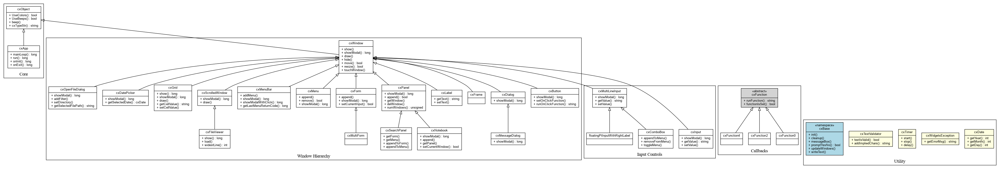
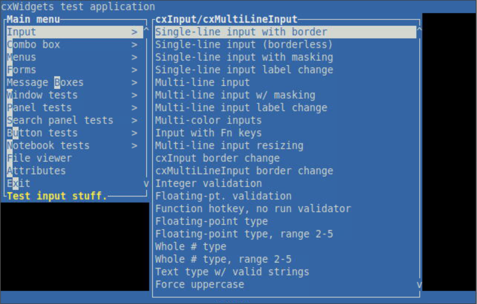
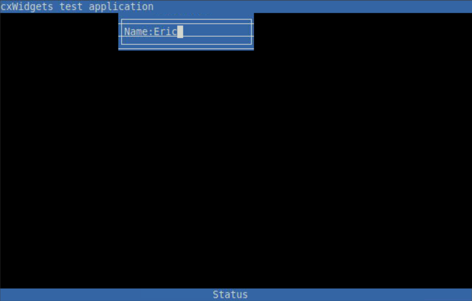
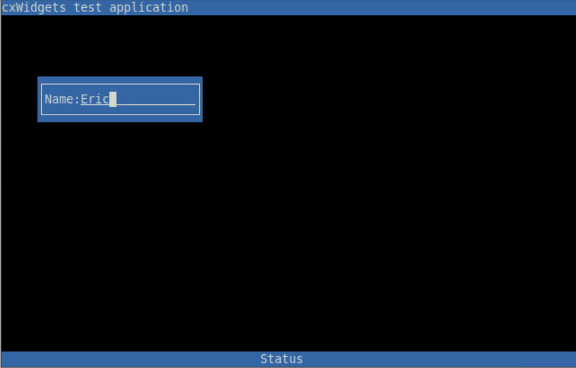
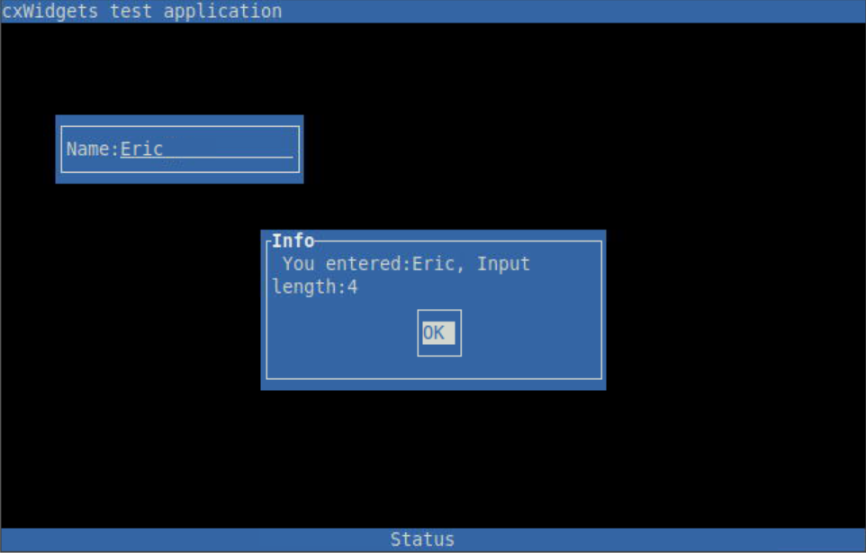
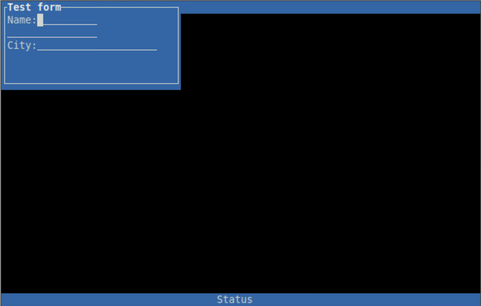
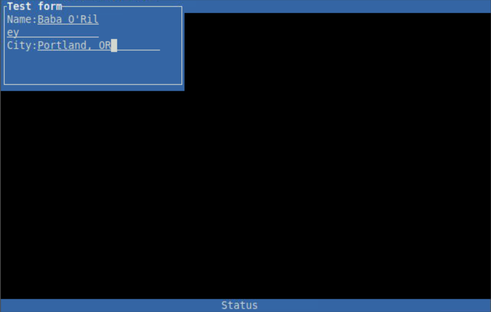

# cxWidgets
This is an object-oriented text user interface library for Linux written in C++.  This is intended for
those developing a text terminal-based software application in Linux with C++.

This is a wrapper around <a href='https://invisible-island.net/ncurses/' target='_blank'>nCurses</a>; thus,
this library requires the package libncurses-dev to be installed, and any software that uses this (and
thus, nCurses) requires the package ncurses-bin and related packages to be installed.

This library contains C++ classes for text-based UI elements such as a button, text input, multi-line text
input, combo box, dialog, form, menu, file viewer, frame, panel, etc.  All the UI element classes
derive from a parent class, cxWindow, to provide abstraction & re-use of general functions contained
within cxWindow; another advantage is polymorphism - if you need a function that would work with any
cxWindow (regardless of whether it's a cxWindow or a subtype), you could pass a cxWindow pointer or
reference to that function.

cxWindow drives from cxObject, which has a few fairly general methods in it.

There is a namespace called cxBase that contains some general utility functions.

You can click <a href='uml/cxWidgets_class_diagram.png' target='_blank'>here</a> to see a (generated)
UML diagram showing the cxWidgets class heirarchy.  Note that in the 'callbacks' section, classes
not depicted include templated cxFunction classes that allow for strongly-typed functions. These
functions are used as event functions for on-load, on-leave, keypresses, etc. The class diagram was
generated by <a href='https://graphviz.org/doc/info/command.html' target='_blank'>dot</a>, which is
part of <a href='https://graphviz.org' target='_blank'>Graphviz</a> (open-source graph visualization
software). In the uml directory, there are also the files cxWidgets_classes.dot and cxWidgets_classes.puml
for use with the dot utility. Also, the genUMLDiagram.sh script in the cxWidgets directory can be run
to re-generate the UML class diagram. 
a href='uml/cxWidgets_class_diagram.png' target='_blank'></a>

In addition to the class library, there are also test tools:
<ul>
<li><b>testApp:</b> An application for manually testing various cxWidgets components. See testApp.cpp. This will build to the executable testApp.
<li><b>cxUnitTest:</b> Automated unit tests. See cxUnitTest.cpp. This builds to the executable cxUnitTest; however, this is incomplete.
</ul>

There are <a href='https://www.doxygen.nl' target='_blank'>Doxygen</a> comments in the source in order to provide
documentation; there is also a Doxyfile available for building Doxygen-based documentation. If you want to generate
documentation, you can simply run 'doxygen' from the cxWidgets directory, and it will output documentation into a
'cxDocs' directory.

There is also a KDevelop project file available if you wish to use KDevelop.

I worked on this library from 2005 to 2007 while working at a startup company called Red Ace Solutions
(which no longer exists).  I worked on the majority of this library, together with Mike Kinney (the owner
of Red Ace Solutions) as well as Glen Thorne.  We developed this library on Fedora Linux.

I have recently modernized the code a bit to be more up to date with C++17, including:
<ul>
<li>Using <a href='https://en.cppreference.com/w/cpp/memory/shared_ptr.html' target='_blank'>std::shared_ptr</a> and <a href='https://en.cppreference.com/w/cpp/memory/unique_ptr.html' target='_blank'>std::unique_ptr</a> to manage dynamically-allocated memory instead of doing manual allocations & de-allocations with 'new' &amp; 'free'. This should help avoid memory leaks.
<li>Initializing class member variables in the declaration (in the header file) as applicable. This is known as default member initialization, or in-class member initialization.
<li>Use of the <a href='https://en.cppreference.com/w/cpp/language/nullptr.html' target='_blank'>'nullptr'</a> keyword instead of 'NULL'. nullptr is a typed null pointer; also, it avoids ambiguous function calls that could happen when using NULL (which is typically defined as (void*)0).
<li>Use of the <a href='http://en.cppreference.com/w/cpp/language/override.html' target='_blank'>'override'</a> keyword to help keep track of which class functions/methods are overridden from base classes.
</ul>

At Red Ace Solutions, we tested cxWidgets on the following operating systems:
<ul>
	<li>IBM AIX 5.3
	<li>IBM AIX 4.3.3
	<li>IBM AIX 4.3.0
		<ul>
			<li>get ncurses-5.3.tar.Z from <a href='http://aixpdslib.seas.ucla.edu/index.html' target='_blank'>http://aixpdslib.seas.ucla.edu/index.html</a>
			<li>compiled and tested on AIX 4.3.0 with g++/gcc 2.95.3 :-)
		</ul>
	<li>Red Hat Enterprise Linux (3, 4 and 5) 
	<li>Fedora Core Linux (4, 5, and 6)
</ul>
We had tried to ensure the code base works well with the following terminals:
<ul>
	<li>Wyse 50, 50+, 55, 60
	<li>IBM 3151 
</ul>
We had tried to ensure the code base works well with the following software emulators:
<ul>
	<li>GNOME Terminal (linux)
	<li>ProcommPlus (wy50, ibm3151) (planned)
	<li>Putty (vt100, vt220, vt320) (planned)
	<li>Windows "telnet" (vt100-works except border lines...) (planned)
	<li>Anzio (wy50, ibm3151, vt220) (planned)
	<li>TinyTerm (vt220; wy50) (planned)
	<li>PowerTerm (planned)
</ul>

Recently, I have made sure this builds on Linux Mint; otherwise, the source & makefile is as it was in 2007.
Aside from Linux Mint, it should also (hopefully) build fairly easily on similar modern distributions such as
Ubuntu, Debian, etc.

We had also been able to build the library on OS X (Darwin), though that hasn't been tested recently.

## Building
There is a makefile in the src directory.  You can build from the command line by going into the src
directory and running make.  That will build object files (*.o) which you can link your project against.
You can also run 'make libcxWidgets.a' to build a static library with all the cxWidgets objects that you
can link your project against.  You can also run 'make libcxWidgets.so' (on Linux) or 'make libcxWidgets.dylib'
(on Mac OS X) to make a dynamic library.
That will also build testApp (the manual test app) as well as a utility called keys, which reports the
key code for any key pressed (you can press ESC or Ctrl-C to quit).

Some notable make commands
<ul>
<li><b>make</b>: Builds testApp and keys (this builds all the object files, as well as the static library libcxWidgets.a)
<li><b>make testApp</b>: Builds just testApp (this builds all the object files, as well as the static library libcxWidgets.a)
<li><b>make libcxWidgets.a</b>: Builds the static library
<li><b>make libcxWidgets.so</b> (Linux) or <b>make libcxWidgets.dylib</b> (Mac OS X): Builds the dynamic library
<li><b>make install</b>: Installs the libraries to your system
<li><b>make clean</b>: Deletes binaries
</ul>

The makefile supports using ccache if it's available on the system.

## Screenshots
These are some screenshots of the 

	
	
	
	
	
	

## Original readme (by Mike Kinney) (README.txt)
README.TXT for cxWidgets - character based "widgets"

Stuff to add/change:
- See http://www.troubleshooters.com/lpm/200405/200405.htm#_A_Simple_Menu for
  possibly an easier way to do menus..

Background: 
  This is an attempt at an object oriented design of a character
  user interface (or CHUI) screen library in C++. We are trying to 
  "wrap" the ncurses library to make it *much* easier to use. 
  We want to hide as much of the implementation as possible. 
  Note: ncurses is licensed under the "MIT-style" of 
  licenses. See their copyright notice in most of their source files.
   Great resources at:
     http://dickey.his.com/ncurses/ncurses-intro.html
     http://www.tldp.org/HOWTO/NCURSES-Programming-HOWTO/screen.html
     http://dickey.his.com/ncurses/ncurses.faq.html
  Note: A few other screen libraries are slang?, and 
  Vermont Views (commercial).

  We really like the wxWidgets.org framework, but needed a minimalistic
  framework for character based terminals. This is our attempt.
  We have not really modeled it after their frame work, though. 

  Our ultimate goal is to be able to merge this codebase with 
  wxWidgets some time in the future, but for now, we would be 
  simply happy if it allows people to write elegant code in c++ 
  for use in character based applications using our library.

  We have tried to make cxWidgets work well in the following operating systems:
    - IBM AIX 5.3
    - IBM AIX 4.3.3
    - IBM AIX 4.3.0
       - get ncurses-5.3.tar.Z from http://aixpdslib.seas.ucla.edu/index.html
       - compiled and tested on AIX 4.3.0 with g++/gcc 2.95.3 :-)
    - Red Hat Enterprise Linux (3, 4 and 5) 
    - Fedora Core Linux (4, 5, and 6)

  We have tried to ensure the code base works well with the following
  terminals:
    - Wyse 50, 50+, 55, 60
    - IBM 3151 

  We have tried to ensure the code base works well with the following
  software emulators:
    - GNOME Terminal (linux)
    - ProcommPlus (wy50, ibm3151) (planned)
    - Putty (vt100, vt220, vt320) (planned)
    - Windows "telnet" (vt100-works except border lines...) (planned)
    - Anzio (wy50, ibm3151, vt220) (planned)
    - TinyTerm (vt220; wy50) (planned)
    - PowerTerm (planned)
    - QVT Term? (planned)

  Note: This is heavily designed for U.S. usage, but could be adapted
  for others. Let us know if you want to allow for different types
  of formats. (i.e., phone number formatting, etc.)

Authors:
   Eric Oulashin (eric@oulashin.com)
   Mike Kinney (kinneym@redacesolutions.com)
   Glen Thorne (gthorne@whoneedsmicrosoft.com)

License:
  cxWidgets Library License
  Copyright (c) 2005-2007 Michael H. Kinney

  Everyone is permitted to copy and distribute verbatim copies of this 
  license document, but changing it is not allowed.

  CXWIDGETS LIBRARY LICENSE
  TERMS AND CONDITIONS FOR COPYING, DISTRIBUTION AND MODIFICATION

  This library is free software; you can redistribute it and/or modify it 
  under the terms of the GNU Library General Public License as published 
  by the Free Software Foundation; either version 2 of the License, 
  or (at your option) any later version.

  This library is distributed in the hope that it will be useful, 
  but WITHOUT ANY WARRANTY; without even the implied warranty of 
  MERCHANTABILITY or FITNESS FOR A PARTICULAR PURPOSE. See the GNU 
  Library General Public License for more details.

  You should have received a copy of the GNU Library General Public 
  License along with this software, usually in a file named COPYING.LIB. 
  If not, write to the Free Software Foundation, Inc., 59 Temple Place, 
  Suite 330, Boston, MA 02111-1307 USA.

  EXCEPTION NOTICE
  1. As a special exception, the copyright holders of this library 
  give permission for additional uses of the text contained in this 
  release of the library as licensed under the cxWindows Library License, 
  applying either this License, or (at your option) any 
  later version of this License as published by the copyright holders 
  of the License document.

  2. The exception is that you may create binary object code versions 
  of any works using this library or based on this library, 
  and use, copy, modify, link and distribute such binary object code 
  files unrestricted under terms of your choice.

  3. If you copy code from files distributed under the terms of the 
  GNU General Public License or the GNU Library General Public License 
  into a copy of this library, as this license permits, the exception 
  does not apply to the code that you add in this way. To avoid 
  misleading anyone as to the status of such modified files, you must 
  delete this exception notice from such code and/or adjust the 
  licensing conditions notice accordingly.

  4. If you write modifications of your own for this library, it is 
  your choice whether to permit this exception to apply to your 
  modifications. If you do not wish that, you must delete the 
  exception notice from such code and/or adjust the licensing conditions 
  notice accordingly. 

Code standards:
- every file must contain this at the top:
   // Copyright (c) 2005-2007 Michael H. Kinney
- method variables are prefixed with "m" like mFoo
- enums are prefixed with 'e' with the rest capitalized,
  i.e., eX_ABC
- parameter variables are prefixed with "p" like pFoo
- include guards on include (.h) files
- each class, prefixed by "cx" has it's own .cpp file
- provide a unit test, when/where possible
- use only c++ comments (i.e., //)
- always use brackets on "()" and "{}" if commands and use like this:
   if (status) {
      // blah
   }
   else {
      // blah
   }
- indentation is always 3 spaces (no tabs)
- variable names are mixedCase not like this_variable
- compile/test with "-Wall"
- run valgrind on it regularly
- KISS
- if option in a derived class, add a default to the base class
- separate options by spaces, like this "foo(one, two, three);" 
  *not* like this: "foo(one,two,three);"
- for loops use spacing like this:
   for (int i=0; i<10; ++i) { // note: spacing!
      x(i);
   }
- Adhere to wxWidget's parameter ordering...

cxBase: A namespace that contains some useful & important functions.
- When we initialize the terminal, we determine if we can do colors. If
  we can, then we set our default color scheme. This can be overridden
  thru the use of method calls in cxObject or a derived class.
- There are positional helpers like:
  Row or y-axis:
      top() - Gives you the top row of the main screen
      centerRow() - Gives the center row of the main screen 
      bottom() - Gives the bottom row of the main screen
  Column or x-axis:
      left() - Gives the leftmost column of the main screen
      centerCol() - Gives the center column of the main screen
      right() - Gives the rightmost column of the main screen
  Message box functions (providing one-line message box functionality):
      These functions use the following parameters:
         pRow: Row for upper-left corner
         pCol: Column for upper-left corner
         pWidth: Message box width
         pTitle: Message box title
         pMessage: Message to appear in the box
         pStatus: Status text to appear at the bottom border
      messageBox(pRow, pCol, pHeight, pWidth, pTitle, pMessage, pStatus)
       - Note: pStatus is optional for this one.
      messageBox(pRow, pCol, pTitle, pMessage, pStatus)
      messageBox(pTitle, pMessage, pStatus)
      messageBox(pMessage, pStatus)
      messageBox(pMessage)

- Example #1: (simple message to the screen)
    cxBase::init();              // required at the top of all progs
    messageBox("Hello, world!");
    cxBase::cleanup();           // required at the end of all progs

- Example #2: (simple splash screen)
    cxBase::init();              // required at the top of all progs
    splash("Hello, world!", 3);
    cxBase::cleanup();           // required at the end of all progs

cxObject: 
- All cxWidgets classes are derived from this class.
- This object sets up, initializes the screen and gets it ready for each
  of the derived classes to do their work.
- Can override the default function keys.
- F5 thru F8 are not "defined"

cxWindow:
- Displays a text window on the screen.
- Positions: We do everything (row,column) where row is the "y-axis" or 
  vertical axis and column is the "x-axis" or horizontal axis.
  All from the top left corner of the screen, zero-based.  For instance,
  using this information:
      a..b
      c..d
  the positions would be: a=(0,0)  b=(0,4)  c=(1,0)  d=(1,4).
- A window can have a title, status, warning line
  Sample:
   ┌Title────────────┐  (title)
   │Test message     │  (message)
   └Press any key...─┘  (status)
- A cxWindow can also use another cxWindow to display the title and
  another cxWindow to display the status.  In such cases, the other
  window will be used instead of the title/status lines.
- Ability to "default" the color scheme, as well as override it.
- Colors: (foreground/background)
    border, title, message, statusLine, warningLine
- Change font to compressed print and display a file, option to
  auto-wrap long lines (or not) (TODO)
- Has the ability to get the contents of the window, like a snapshot
  (including the title & status).  We want to be able to strip out
  the attributes and return it as a string.
- Can be added to a parent window, and can contain subwindows
- When you call show() for a window, the window draws itself and then
  calls show() for all its subwindows.
- The show() method returns an int to support derived windows where
  it would be handy to override show() and return some kind of code
  (see cxMessageDialog).
- Note: There are 2 methods for moving a window: move() and
  moveRelative().  move() moves a window based on absolute screen
  coordinates, and moveRelative() moves a window relative to itself
  (with horizontal and vertical offsets).  moveRelative() simply
  calls move() with the new absolute coordinates.  This has the
  advantage that if you derive a custom class from cxWindow and
  you need to override move(), you don't need to override
  moveRelative().

- Example #1: (implements a "messageBox()")
   cxWindow aWindow("Some title", "This is a sample message box.", "Press any key...");
   cxWindow.show();
   curs_set(0); // hide cursor
   getchar();   // get any key
   curs_set(1); // set cursor back to normal
   clear();     // clear screen
   refresh();   // repaint the screen

- Example #2: Creating a parent window with a subwindow
  cxWindow aWindow(NULL, 0, 0, 10, 20, "Title", "Sample message", "Status");
  cxWindow subwin(&aWindow, 2, 1, 8, 12, "Title2", "Subwin message", "Subwin status");
  aWindow.show();
  - Note: The positions are absolute.
  - Note: Many of the other classes, such as cxButton, cxFileViewer, cxMessageDialog,
    etc. are derived from cxWindow, which means they have all the functions of
    cxWindow (such as show(), etc.) and can also belong to a parent window and have
    subwindows of their own.

cxButton:
- derived from cxWindow
- Manages buttons.

cxFileViewer:
- derived from cxWindow
- Display the contents of a file in a window. It should be able to 
  view files larger than the window size.
- The number of lines/characters will show in status bar.
- The filename will show in the title bar.
- Keys:
   right arrow - move one character to the right (if there is more to view)
   left arrow - move one character to the left (if there is more to view)
   ESCAPE - cancel (Are you sure you want to quit?)
   up arrow - scroll up one line
   down arrow - scroll down one line
   page up - scroll up a page
   page down - scroll down a page
   F10 - (Exit)
   HOME - go to top/left
   END - go to bottom/right

cxDialog:
- Represents a dialog
- Derived from cxWindow
- Overrides show() to wait for user input, and returns a
  code based on user interaction.
  - When the escape or cancel key is pressed, cxID_QUIT
    is returned.
  - When the enter or 'go' key is pressed, cxID_OK is
    returned.
- Defines the following return codes (returned by show()):
  cxID_OK
  cxID_CANCEL
  cxID_EXIT
  cxID_QUIT

cxMessageDialog:
- Derived from cxDialog
- Represents a dialog box with "OK" and "Cancel" buttons
- Can optionally show only the "OK" or "Cancel" button
  through the style parameter
- Can also display "Yes" and "No" on the buttons instead
  of "OK" and "Cancel"
- Overrides show() and waits for user input, and returns a
  code based on user interaction.
  - The arrow and tab keys can be used to move between the
    2 buttons.
  - When the escape or cancel key is pressed, cxID_QUIT
    is returned.
  - When the enter, space, or 'go' key is pressed a code
    corresponding with the selected button is returned.
    - cxID_OK is returned if the user selected the "OK" button.
    - cxID_CANCEL is returned if the user selected the "Cancel" button.
Constructor:
  cxMessageDialog(pParentWindow, pRow, pCol, pHeight, pWidth,
                  pTitle, pMessage, pStyle, pStatus)
  pStyle can be any of the following (or multiple, bitwise OR'ed together):
   cxYES         // Show Yes button
   cxOK          // Show OK button
   cxNO          // Show No button
   cxYES_NO      // Show Yes and No buttons (equivalent to cxYES | cxNO)
   cxCANCEL      // Show Cancel button
   cxYES_DEFAULT // (default)
   cxNO_DEFAULT  // Set No button to default

cxField:
TODO: All of this
- Special pre-built fields for ease of use:
   - "phone" - phone number entry
      - phone entries: "(DDD)DDD-DDDD" "DDD-DDD-DDDD"
   - "email" - email address (ensures valid email address, postprocessing)
   - "web" - web address (ensures valid url post, processing)
   - "zipcode" - zip code entry
      - valid formats "DDDDD", "DDDDD-DDDD" (Handle Canadian provinces?)
      - Notes: 
         - If format is "DDDDD" and initial value is "1234", then 
           after processing thru the field, it will be changed to "01234".
         - If the format is "DDDDD-DDDD" and the the initial value is
           "12345", then the data will stay that way, unless you add any
           characters after the "-", in which case you must enter all four
           digits.
   - "time" - time field
      - time formats: "HH:MM" (24hr), "HH:MMam"
      - Note: If using "am" format and user enters "20" it should
        convert it to "08:00pm"
      - time codes: h=hour, m=minute, s=seconds
      - Keys:
           n - now
        (only if "am" is in the format string, otherwise 24hr time is used)
           a - change to am
           p - change to pm
           PAGEUP - change to am 
           PAGEDOWN - change to pm
   - "state" - pick one of the states, allow entry for only one 
   - "province" - pick one of the Canadian provinces, allow entry for only one 
   - "stateORprovince" - allow either state or province
   - "date" - date field
      - date formats: 
         "MMDDYY", "MM/DD/YY", "MM/DD/YYYY", "YYYY-MM-DD", "MMYY", "YYMM"
      - date codes: m=month, d=day, y=year, w=week
      - Note: If you enter "010203" for any of the formats, it should 
        automatically convert it to the correctly displayed format. 
      - Note: 1950 is the "split" from "19" and "20".
      - quick entry: If you enter the following (and the ENTER or TAB key):
           "0" - today's date (in the correct format)
           "-1" yesterday
           "1" tomorrow
           "1w" one week from today
           "-1w" one week ago
           "-1m" -1 month
           PAGEUP - same as -1m 
           PAGEDOWN - same as +1m 

cxInput: Derived from cxWindow
   A single-line borderless window for doing single-line input.  This
   class would be a window that has a string that contains the user's
   input, along with a getter method to retreive the user's input.
   TODO: Add character validation
- Field validation:
   d - any digit [0-9]
   D - Like "d", but each character is required
   n - any number [0-9-.]
   N - like "n", but each character is required
       (i.e., cannot go to next field until you either clear the field
        or enter each character)
   @ - is a fixed decimal (for instance nnn@nn) (i.e., "%6.2f")
       (where you do not have to press the decimal; i.e, "12345 would
        be accepted as "123.45")
   : - is fixed (as in "time")
   - - For dates
   ( or ) - For stuff like phone numbers, etc.
   [ or ]
   . - is a decimal (for instance nnn.nn) 
       (where you enter the decimal, but it always remains aligned
        like this "38" shows as "38.00" and "38.1" shows as "38.10".
   p - alpha numeric plus [0-9a-zA-Z ,-.] (useful in names)
   P - like p, but each character is required
   a - alpha numeric [0-9a-zA-Z] (no punctuation, nor space)
   A - like a, but each character is required
   x - is any character [0-9a-zA-Z ,./;'[]\-=!@#$%^&*()_+<>?:"{}|]
   X - like x, but each character is required
   r - compares each keypress with a regular expression
   m - Masked (i.e., password)
If a user enters an invalid character, then beep, display a message
in the status line.
The following regular expressions (if needed) could be used to
validate an entire string for certain inputs:
Digits (0-9): ^[0-9]*$
Digits with decimal points: ^([0-9]*[0-9.][0-9]*)*$
  (Back-quote the decimal point, but not the parenthesis, in C++ code)

cxMultiLineInput: Derived from cxWindow
  A multi-line input window, containing a label and many inputLine windows
  for doing multi-line input.  This class would have the ability of handling
  arrow keys for movement between the inputLine windows, and the ability to
  concatenate all user inputs to a single string.
  There are several functions that can set up functions to be run in the
  input when focus is set:
   - setOnFocusFunction() - Sets a function to be run immediately at the beginning of setFocus()
   - setOnKeyFunction() - Sets a function to be run after each keypress (runs inside the input loop)
   - setValidatorFunction() - Sets a function to be run to validate the input text.  The function
         set here is run after the input loop - basically, after the user has entered all the
         input for the field.  However, if the function set here says that the input is invalid,
         cxMultiLineInput will re-run its input loop until the input is valid according to
         the validator function so that the user can correct the input.
   - setOnLeaveFunction() - Sets a function to be run right before setFocus() exits

cxForm: (FORMS)
- Diplay a form for data input. Typically you will do something with the input.
  By default, if you leave the last field, you will exit the form. 
  (see "quit" vs "exit" below)
- "quit" versus "exit": There is a distinction as to how a user left the
   form. "quit" means you did not want to proceed. (i.e., ESCAPE was pressed)
   "exit" means we completed the form. (i.e., F10, ENTER or TAB on last field
   if the autoExit option is not set.)
- Should we allow the following field options:
   CLEARONKEY: Clear the field when the user types a valid key
   LEFT: Left-align
   RIGHT: Right-align
   SKIP: Display the field but don't allow the user to edit it
- You can run a function at different points in the form/field:
   - at the beginning of the form
   - at the end of the form
   - upon quit
   - upon entering a field
   - upon leaving a field
   - upon a non-navigation key (i.e., pageUp, pageDown, plusKey)
   TODO: Add function pointers to cxInput to handle these functions
- Navigation Keys:
   Inter field:
      TODO: ESCAPE - cancels form (should we prompt to "Are you sure?")
      up arrow - previous field (if at first field, wrap to last field?)
      down arrow - next field (if at last field, wrap to first field?)
      F10 - go

   Intra field:
      right - move one character to the right
      left - move one character to the left
      backspace - erases one character to the left
      delete - erases one character to the right
      home - moves to the very first position in the field
      end - moves to the last chacter in the field
      enter - moves to next field (if on the last field then it is
              the same thing as F10, unless you specifically 
              set autoExit to false.)
      tab - moves to next field
      TODO: shift-tab - moves to previous field (possibly use KEY_BTAB?)

- Function Keys:
   TODO: Function key label line: 
    (Note: Not sure how characters there are per key. Will need to 
     these this!)
      "F1=Hlp F2=Cho F3=Clr F4=Can                            F10=Go"
    Need to put this in the status area? or next to last line? Thoughts?

- Choice lists:
   TODO: Do this ..
   Essentially a drop down "menu" with choices and fills in the field
   with the selection.
   An example would be, pick from the following printers:
   Printer: prn100
            prn101
            prn102
            prn103
   TODO: write the example code here (after writing it in testApp.cpp).
  
Form Example #1: (standard form)
   TODO: Update this example
   cxForm aForm(NULL, 0, 0, 20, 50, "Sample form");
   string name;
   string age;
   string city;

   aForm.position("center", "center");
   aForm.alignFields("data"); // default is "left"
   aForm.append(1, 1, 1, 20, "Name:");
   aForm.append(2, 1, 1, 10, "Age:");
   aForm.append(3, 1, 1, 30, "City:");
   name = aForm.getValue("Name:");
   age = aForm.getValue("Age:");
   city = aForm.getValue("City:");

   // if you define any functionKeyLabels or set aForm.funtionKeyLabels(true)
   // then the fields will display on the last line of the window (in the
   // border!)
   aForm.functionKeyLabel("F1","Hlp");
   aForm.functionKeyLabel("F10","Go");

   // By default, if you enter thru the last field, you EXIT the form.
   // This overrides that and makes you either F10 to EXIT the form
   // or hit ESCAPE to quit the form.
   aForm.autoExit(false); 

   status=aForm.process(); // display, process, and clean up after itself
   if (status) {
      // they either hit ENTER thru the last field or hit F10 (i.e., exit)
      messageBox("Thanks for completing our form. You get a gold star!")
   }
   else {
      // they hit ESCAPE (i.e., quit)
      messageBox("Can't complete anything, can you?!?");
   }

Form Example #2: (simplest form)
   cxForm aForm;
   int anIQ;

   aForm.title("R U smart?");
   aForm.newField("Enter your iq:", "NNN", anIQ);
   if (aForm.process()) {
      messageBox("Your iq is:" + toString(anIQ) + ". Wow!");
   }

Form Example #3: 
   // Do not need to do absolute positioning of the fields, we
   // can handle that for you. 
   // This will display a form that will create a new window that
   // is centered and the border is the smallest necessary to allow
   // for the form to fit.
   aForm.title("Sample Form"); // not really necessary, but it is eye candy
   aForm.newField("Your name:", "xxxxxxxxxx", aString, "Enter your name.");
   aForm.newField("Number:", "nnnn", aNumber, "Enter some number.");
   status=aForm.process(); // display, process, and clean up after itself
   if (status) {
      messageBox("Thanks for randomly entering data!");
   }
   else {
      messageBox("I bet you do not answer surveys either!");
   }

cxMenu: (MENUS)
- Allow you to select an item from a list (it will return a code corresponding to that item).
- Menu types: pull-right, pop-up
- Keys:
   up arrow - go to previous menu item (if at top, go to bottom)
   down arrow - go to next item (if at bottom, go to top)
   ESCAPE - quit
   F1 - Help
   F10 - select highlighted entry
   ENTER - select highlighted entry
TODO: Add hotkeys
TODO: finish the spacebar to allow "menu jumping".

- Example #1:
   // functions for example below
   void test1() {
      // messageBox() box calls "cxWindow aWindow; aWindow.message();"
      messageBox("center", "center", "Test1", "You are in test1.");
   }
   void test2() {
      messageBox("center", "center", "Test2", "You are in test2.");
   }
   void test3() {
      messageBox("center", "center", "Test3", "You are in test3.");
   }

   TODO: Update this example
   cxMenu aMenu;
   // this allows you to enter a '1' or highlight the entry and hit enter
   aMenu.add('1', "Some test menu", test1);
   aMenu.add('2', "Another test menu", test2);
   // can leave the 'hotkey' off
   aMenu.add("Yet another test menu", test3); 
   // Should we follow the "windows" way and do x& for hot key? (and color?)
   aMenu.colors("blue", "white");
   aMenu.align("left");
   aMenu.border("lines");
   aMenu.position("center", "center");
   aMenu.process(); // display, process and clean up after itself

cxFieldFunction: Derived from cxObject
- This is basically a holder for a function pointer and was
  designed initially for use with the cxInput and cxMultiLineInput
  classes.  This class lets you set the function pointer in the
  constructor, as well as whether the function's return value should
  be used by the caller.  Note that the function must have the following
  signature:
   string func(void *p1, void *p2)
  The parameters are void pointers because it can't be known by this
  class what types of objects your functions will need.  So, any
  function that you pass to this class must have this signature, and
  will have to cast the pointers to the types that it uses.  The
  function is also assumed to return a string (in the case of lookup
  functions).

Possible future projects:
- port "snakes" (game)
- port "centipede-type" (game)
- Screen saver (cxScreenSaver class?)
